author: Mats Stellwall
id: automating-document-processing-workflows-with-document-ai
categories: snowflake-site:taxonomy/solution-center/certification/quickstart, snowflake-site:taxonomy/product/ai, snowflake-site:taxonomy/snowflake-feature/ingestion, snowflake-site:taxonomy/snowflake-feature/document-ai
language: en
summary: Automate document processing with Snowflake AI_EXTRACT for invoice extraction, form digitization, OCR, and data validation workflows.
environments: web
status: Published 
feedback link: https://github.com/Snowflake-Labs/sfguides/issues


# Automating Document Processing Workflows With AI_EXTRACT
<!-- ------------------------ -->

## Overview 

Through this quickstart guide, you will explore AI_EXTRACT. You will set up your Snowflake environment, use AI_EXTRACT to extract values from documents, create a document extraction pipline using AI_EXTRACT and use streamlit to build a application to verify the extracted values.  

### What is AI_EXTRACT 
AI_EXTRACT is a Cortex AI Function that lets you extract structured information, such as entities, lists, and tables, from text or document files, by asking questions in natural language or by describing information to be extracted. It can be used with other functions to create custom document processing pipelines for a variety of use cases.

AI_EXTRACT can process documents of various formats in multiple languages and extract information from both text-heavy paragraphs and content in a graphical form, such as logos, handwritten text (for example, signatures), tables, or checkmarks). AI_EXTRACT can extract information in the following structured formats:

* Entity: Ask questions in natural language or describe the information to be extracted (such as city, street, or ZIP code).
* List (or array): You can provide a JSON schema to extract an array or list of information present in the document, such as the name of all account holders in a bank statement or a list of all addresses in a Document.
* Table: Provide a JSON schema to extract tabular data present in the document by specifying the table title and a list of columns that should be extracted.

AI_EXTRACT scales automatically with your workload by processing multiple documents simultaneously. Documents can be processed directly from object storage to avoid unnecessary data movement.

AI_EXTRACT uses arctic-extract, a proprietary vision based large language model (LLM) that delivers high extraction accuracy.

### What You’ll Learn 
* how use a AI_EXTRACTto build a data pipeline
* how to build a Streamlit application for verifying documents

### Prerequisites
* [Git](https://git-scm.com/book/en/v2/Getting-Started-Installing-Git) installed
    >
    >Clone or download the [git repo](https://github.com/Snowflake-Labs/sfguide-getting-started-with-document-ai)
* A Snowflake account. If you do not have a Snowflake account, you can register for a [free trial account](https://signup.snowflake.com/?utm_source=snowflake-devrel&utm_medium=developer-guides&utm_cta=developer-guides).
* A Snowflake account login with a role that has the ability to create role, database, schema, tables, stages and assign permissions. If not, you will need to register for a free trial or use a different role.

### What You’ll Build 
You will use documents from the [Contract Understanding Atticus Dataset (CUAD) v1.](https://doi.org/10.5281/zenodo.4595826) in order to extract values and verifying that clauses exists in co-branding agreements. The QuickStart [git repo](https://github.com/Snowflake-Labs/sfguide-getting-started-with-document-ai) includes the documents we are going to use.

> 
>
> **Citation**  
> The Atticus Project. (2021). Contract Understanding Atticus Dataset (CUAD) v1. https://doi.org/10.5281/zenodo.4595826

<!-- ------------------------ -->
## Setup the Snowflake enviroment

### Overview
This section covers cloning of the GitHub repository and creating the needed Snowflake objects (i.e role, warehouse, database, schema, etc..)

### Clone the git repository
The very first step is to clone the [GitHub repository](https://github.com/Snowflake-Labs/sfguide-getting-started-with-document-ai). This repository contains all the code you will need to successfully complete this QuickStart Guide.

Using HTTPS:

```shell
git clone https://github.com/Snowflake-Labs/sfguide-getting-started-with-document-ai.git
```

OR, using SSH:

```shell
git clone git@github.com:Snowflake-Labs/sfguide-getting-started-with-document-ai.git
```

### Creating Objects
Run the following SQL commands, those can also be found in the [setup.sql](https://github.com/Snowflake-Labs/sfguide-getting-started-with-document-ai/blob/main/setup.sql) file, in a SQL worksheet to create the [warehouse](https://docs.snowflake.com/en/sql-reference/sql/create-warehouse), [database](https://docs.snowflake.com/en/sql-reference/sql/create-database), [schema](https://docs.snowflake.com/en/sql-reference/sql/create-schema) and [role](https://docs.snowflake.com/en/sql-reference/sql/create-role).

```SQL
USE ROLE ACCOUNTADMIN;

-- CREATE A ROLE TO BE USED FOR THE QUICKSTART
CREATE ROLE ai_extract_qs_role;

GRANT ROLE ai_extract_qs_role TO USER <YOUR USER>;

-- CREATE A WAREHOUSE TO BE USED
CREATE WAREHOUSE ai_extract_qs_wh;

-- GIVE THE doc_ai_qs_role ROLE ACCESS TO THE WAREHOUSE
GRANT USAGE, OPERATE, MODIFY ON WAREHOUSE ai_extract_qs_wh TO ROLE ai_extract_qs_role;

-- CREATE DATABASE AND SCHEMA TO BE USED, GIVE THE doc_ai_qs_role ACCESS
CREATE DATABASE ai_extract_qs_db;
GRANT CREATE SCHEMA, MODIFY, USAGE ON DATABASE ai_extract_qs_db TO ROLE ai_extract_qs_role;

-- GRANT ACCESS TO SNOWFLAKE CORTEX AI FUNCTIONS
GRANT DATABASE ROLE SNOWFLAKE.CORTEX_USER TO ROLE ai_extract_qs_role;

-- CHANGE TO THE QUICKSTART ROLE
USE ROLE ai_extract_qs_role;

-- CREATE A SCHEMA FOR THE STAGE, TABLES etc
CREATE SCHEMA ai_extract_qs_db.ai_extract_schema;
GRANT USAGE ON SCHEMA ai_extract_qs_db.ai_extract_schema TO ROLE ai_extract_qs_role;

-- CREATE A STAGE FOR STORING DOCUMENTS
CREATE STAGE ai_extract_qs_db.ai_extract_schema.ai_extract_stage
  DIRECTORY = (enable = true)
  ENCRYPTION = (type = 'snowflake_sse');

-- SCHEMA FOR THE STREAMLIT APP
CREATE SCHEMA ai_extract_qs_db.streamlit_schema;

-- TABLE FOR THE STREAMLIT APP
CREATE OR REPLACE TABLE ai_extract_qs_db.ai_extract_schema.CO_BRANDING_AGREEMENTS_VERIFIED
(
    file_name string
    , snowflake_file_url string
    , verification_date TIMESTAMP
    , verification_user string
);

```
We are now ready to start.

<!-- ------------------------ -->
## Design the extraction

### Overview

Since AI_EXTRACT is a Cortex AI Function, we can use SQL to define the value extraction questions, if we want to have the SQL generated for us we can use the **Document Processing Playground** which is a visual interface against AI_EXTRACT and AI_PARSE_DOCUMENT, that is not covered in this Qucikstart.

### Step 1: Open the Document Processing Playground and upload documents
In Snowsight make sure you have changed the role to AI_EXTRACT_QS_ROLE, you can see the active role if you click on the cirkel in the left bottom corner.  
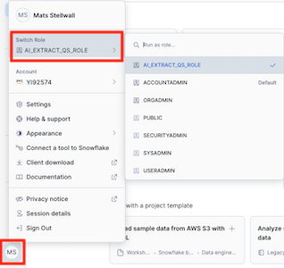

1. Navigate to **Document Processing Playground** by clicking on **AI & ML** and then **AI Studio**.  
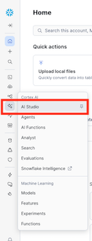  
2. Click on **Document Processing Playground**.  
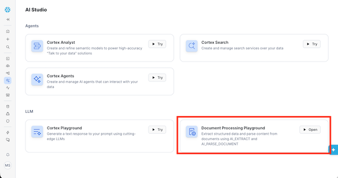  
3. Select **AI_EXTRACT_QS_WH** in the warehouse dropdown in the top right corner.  
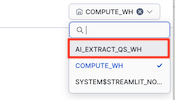  
4. Click on **Choose file** in **Upload files to get started**.  
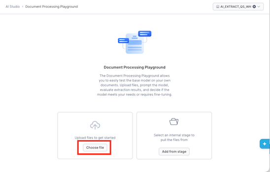  
5. Add the documents in the **training_documents** folder and click **Upload**.  
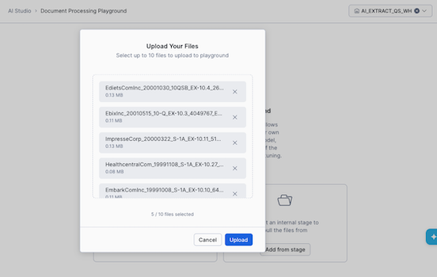  

### Step 3: Specify values
In this step we will define the questions for extracting values and the name of the key the value will be added to.  

1. Enter **effective_date** as the **Key** and **What is the effective date of the agreement?** as the **Question** and click on **Add Prompt**.  
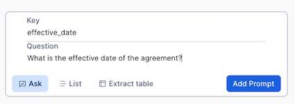  

2. You should now see an awnser for the prompt based on the document to the right.  
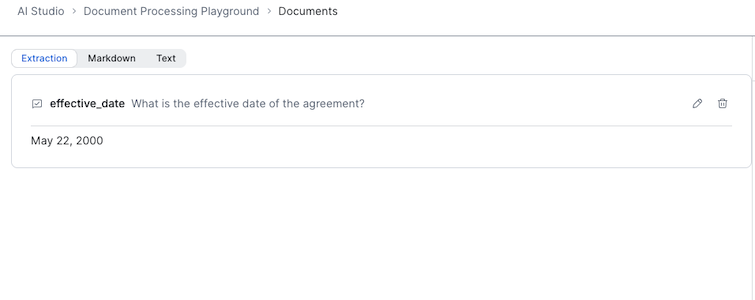  

2. Add the rest of the the value names and questions from the table below

| KEY | QUESTION |
|------------|----------|
| duration | What is the duration of the agreement? |
| notice_period | What is the notice period for termination? |
| indemnification_clause | Is there an indemnification clause? |
| renewal_options | Are there any renewal options or conditions mentioned? |
| force_majeure | Is there a force majeure clause? |
| payment_terms | What are the payment terms, including amounts, timing, and conditions? |

4. We can get a list of values for a key, by clicking on **List** and then add **parties** as the **Key** and **List all the parties involved in this agreement** as the question and then click on **Add Prompt**.  
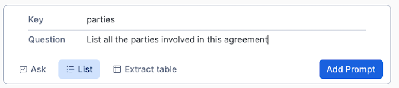  
5. Once all values are defined you can test the prompts with different documents by changing the current one in the dropdown.  

We are now ready to create a document processing pipeline.

<!-- ------------------------ -->
## Create a document processing pipeline

### Overview
In this step will we use the generated SQL from the previous step as the startying point for creating a docoment extraction pipeline.

### Step 1: Get the generated SQL 

1. Click on **<> Code Snippets** in the top right corner.  
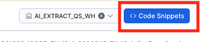  

2. Click on the copy icon in the right corner of the **Extract Data** snippet, paste it into a text document so you can get it later.  
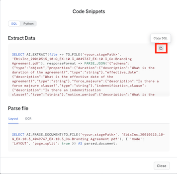  

3. Close the dialog and then navigate to workspaces by going to **Projects -> Workspaces**.  
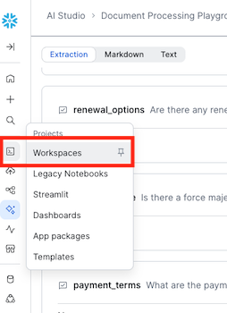  

### Step 2: Upload documents to a stage
Second step is to add the documnets we want to extract values from to a Snowflake stage, created in the Setup the Snowflake enviroment step.

1. Navigate to the stage by going to **Data -> Databases -> AI_EXTRACT_QS_DB -> AI_EXTRACT_SCHEMA -> Stages -> AI_EXTRACT_STAGE**.  
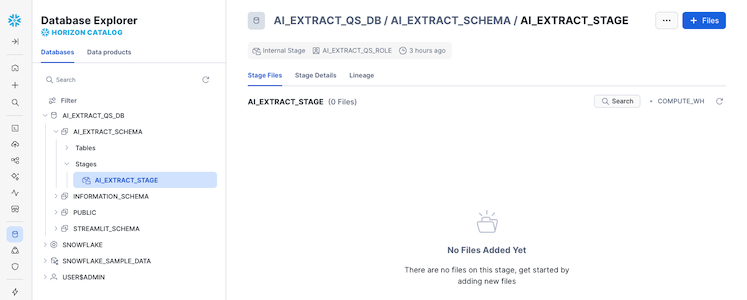  
2. Click on **+ Files** and add all documents in the **extraction_documents** folder to the dialog and click **Upload**  
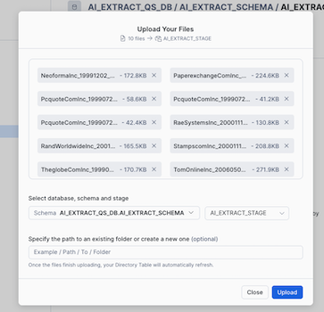  


### Step 3: Exectue the extraction SQL
Third step is to use the published model to extract values from our documents, all SQLs can also be found in the [extraction.sql](https://github.com/Snowflake-Labs/sfguide-getting-started-with-document-ai/blob/main/extraction.sql) file.
1. Navigate back to workspaces and create a new SQL file
2. Check that we have files in the stage by executing the following SQL
```SQL
USE ROLE doc_ai_qs_role;
USE WAREHOUSE doc_ai_qs_wh;
USE DATABASE doc_ai_qs_db;
USE SCHEMA doc_ai_schema;

LS @doc_ai_stage;
```
3. Add the following SQL, this will create a table, **CO_BRANDING_AGREEMENTS**, that will contain the extracted values and the scores of the extractions. Execture the SQL, this wil take a couple of minutes.  
```SQL
-- Create a table with all values and scores
CREATE OR REPLACE TABLE AI_EXTRACT_QS_DB.AI_EXTRACT_SCHEMA.CO_BRANDING_AGREEMENTS_VERIFIED
AS
-- First part gets the result from using AI_EXTRACT on the pdf documents as a JSON with additional metadata
WITH extracted_values as (
    SELECT 
        relative_path as file_name
        , size as file_size
        , last_modified
        , file_url as snowflake_file_url
        , AI_EXTRACT(file => TO_FILE('@AI_EXTRACT_STAGE', relative_path), 
                responseFormat => 
                    PARSE_JSON('{
                            "schema": {
                                    "type": "object",
                                    "properties": {
                                            "duration": {"description":"What is the duration of the agreement?","type":"string"},
                                            "effective_date":{"description":"What is the effective date of the agreement?","type":"string"},
                                            "force_majeure":{"description":"Is there a force majeure clause?","type":"string"},
                                            "indemnification_clause":{"description":"Is there an indemnification clause?","type":"string"},
                                            "notice_period":{"description":"What is the notice period for termination?","type":"string"},
                                            "parties":{"description":"List all the parties involved in this agreement","type":"array"},
                                            "payment_terms":{"description":"What are the payment terms, including amounts, timing, and conditions?","type":"string"},
                                            "renewal_options":{"description":"Are there any renewal options or conditions mentioned?","type":"string"}
                                        }
                                    }
                                }'),
                scores => TRUE) AS extracted_data
    FROM DIRECTORY (@AI_EXTRACT_STAGE) 
)
-- Second part extract the values and the scores from the JSON into columns
select
    file_name
    , file_size
    , last_modified
    , snowflake_file_url
    , extracted_data:scoring:scores:parties:score::FLOAT AS parties_score
    , extracted_data:response:parties::ARRAY as parties_array
    , ARRAY_SIZE(parties_array) AS identified_parties
    , extracted_data:scoring:scores:effective_date:score::FLOAT AS effective_date_score
    , extracted_data:response:effective_date::STRING AS effective_date_value
    , extracted_data:scoring:scores:duration:score::FLOAT AS agreement_duration_score
    , extracted_data:response:duration::STRING AS agreement_duration_value
    , extracted_data:scoring:scores:notice_period:score::FLOAT AS notice_period_score
    , extracted_data:response:notice_period::STRING AS notice_period_value
    , extracted_data:scoring:scores:payment_terms:score::FLOAT AS payment_terms_score
    , extracted_data:response:payment_terms::STRING AS payment_terms_value
    , extracted_data:scoring:scores:force_majeure:score::FLOAT AS have_force_majeure_score
    , extracted_data:response:force_majeure::STRING AS have_force_majeure_value
    , extracted_data:scoring:scores:indemnification_clause:score::FLOAT AS have_indemnification_clause_score
    , extracted_data:response:indemnification_clause::STRING AS have_indemnification_clause_value
    , extracted_data:scoring:scores:renewal_options:score::FLOAT AS have_renewal_options_score
    , extracted_data:response:renewal_options::STRING AS have_renewal_options_value
from extracted_values;
```  
4. Check that there is a result by running the following SQL  
```SQL
select * from AI_EXTRACT_QS_DB.AI_EXTRACT_SCHEMA.CO_BRANDING_AGREEMENTS_VERIFIED;
```  
  

We have now applied our model on all our documents and stored the extraced values in a table, if we wanted to run this every time we ad a new document to the stage we can use [streams](https://docs.snowflake.com/en/user-guide/streams-intro) and [tasks](https://docs.snowflake.com/en/user-guide/tasks-intro).

Next step is to create the Streamlit application for verifying the extracted values.

<!-- ------------------------ -->
## Create a Streamlit application

### Overview
In this step we will create a Streamlit application in Snowflake to be used for verifying the extracted values.

### Step 1: Create a Streamlit application
The Python code for this step can also be found [streamlit_app.py](https://github.com/Snowflake-Labs/sfguide-getting-started-with-document-ai/blob/main/streamlit_app.py) file.
1. In the workspace click on **+ Add New** and choose **Streamlit App**  
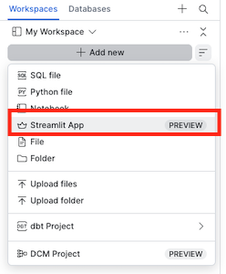  
3. Click on **+ Streamlit App**  
  
4. Give it a title and choose the **DOCK_AI_QS_DB** and **STREAMLIT_SCHEMA** for **App location** and **DOC_AI_WH** as **App warehouse** and click **Create**  
  
5. Replace the code in the left pane with the code below  
```python
# Import python packages
import streamlit as st
from snowflake.snowpark.context import get_active_session
from snowflake.snowpark import functions as snow_funcs

import pypdfium2 as pdfium
from datetime import datetime

st.set_page_config(layout="wide")

# Write directly to the app
st.title("Co-Branding Agreement Verification :ledger:")
st.write(
    """A example Streamlit Application that enables users to verify values that is missing or have a extraction score below a threshold.
    """
)

# Get the current credentials
session = get_active_session()

#
#  Parameters
# 
doc_ai_context = "doc_ai_qs_db.doc_ai_schema"
doc_ai_source_table = "CO_BRANDING_AGREEMENTS"
doc_ai_source_verify_table = "CO_BRANDING_AGREEMENTS_VERIFIED"
doc_ai_doc_stage = "doc_ai_stage"

# Dict that has the name of the columns that needs to be verified, it has the column name of the column 
# with value and column with the score
value_dict = {
    "EFFECTIVE_DATE": {
        "VAL_COL": "EFFECTIVE_DATE_VALUE",
        "SCORE_COL": "EFFECTIVE_DATE_SCORE"
    },
    "AGREEMENT_DURATION": {
        "VAL_COL": "AGREEMENT_DURATION_VALUE",
        "SCORE_COL": "AGREEMENT_DURATION_SCORE"
    },
    "NOTICE_PERIOD": {
        "VAL_COL": "NOTICE_PERIOD_VALUE",
        "SCORE_COL": "NOTICE_PERIOD_SCORE"
    },
    "PAYMENT_TERMS": {
        "VAL_COL": "PAYMENT_TERMS_VALUE",
        "SCORE_COL": "PAYMENT_TERMS_SCORE"
    },
    "HAVE_FORCE_MAJEURE": {
        "VAL_COL": "HAVE_FORCE_MAJEURE_VALUE",
        "SCORE_COL": "HAVE_FORCE_MAJEURE_SCORE"
    },
    "HAVE_INDEMNIFICATION_CLAUSE": {
        "VAL_COL": "HAVE_INDEMNIFICATION_CLAUSE_VALUE",
        "SCORE_COL": "HAVE_INDEMNIFICATION_CLAUSE_SCORE"
    },
    "HAVE_RENEWAL_OPTIONS": {
        "VAL_COL": "HAVE_RENEWAL_OPTIONS_VALUE",
        "SCORE_COL": "HAVE_RENEWAL_OPTIONS_SCORE"
    }
}

# The minimum score needed to not be verified
threshold_score = 0.5

# HELPER FUNCTIONS
# Function to generate filter to only get the rows that are missing values or have a score below the threashold
def generate_filter(col_dict:dict,  score_val:float): #score_cols:list, score_val:float, val_cols:list):
    
    filter_exp = ''

    # For each column
    for col in col_dict:
        # Create the filter on score threashold or missing value
        if len(filter_exp) > 0:
                filter_exp += ' OR '
        filter_exp += f'(({col_dict[col]["SCORE_COL"]} <= {score_val} ) OR ({col_dict[col]["VAL_COL"]} IS NULL))'

    if len(filter_exp) > 0:
       filter_exp = f'({filter_exp}) AND ' 
    
    # Filter out documents already verified
    filter_exp  += 'verification_date is null'
    return filter_exp

# Generates a column list for counting the number of documents that is missing values or a score less that the threashold
# by each column
def count_missing_select(col_dict:dict, score_val:float):
    select_list = []

    for col in col_dict:
        col_exp = (snow_funcs.sum(
                          snow_funcs.iff(
                                    (
                                        (snow_funcs.col(col_dict[col]["VAL_COL"]).is_null())
                                        | 
                                        (snow_funcs.col(col_dict[col]["SCORE_COL"]) <= score_val)
                                    ), 1,0
                              )
                      ).as_(col)
                )
        select_list.append(col_exp)
        
    return select_list

# Function to display a pdf page
def display_pdf_page():
    pdf = st.session_state['pdf_doc']
    page = pdf[st.session_state['pdf_page']]
            
    bitmap = page.render(
                    scale = 8, 
                    rotation = 0,
            )
    pil_image = bitmap.to_pil()
    st.image(pil_image)

# Function to move to the next PDF page
def next_pdf_page():
    if st.session_state.pdf_page + 1 >= len(st.session_state['pdf_doc']):
        st.session_state.pdf_page = 0
    else:
        st.session_state.pdf_page += 1

# Function to move to the previous PDF page
def previous_pdf_page():
    if st.session_state.pdf_page > 0:
        st.session_state.pdf_page -= 1

# Function to get the name of all documents that need verification
def get_documents(doc_df):
    
    lst_docs = [dbRow[0] for dbRow in doc_df.collect()]
    # Add a default None value
    lst_docs.insert(0, None)
    return lst_docs

# MAIN

# Get the table with all documents with extracted values
df_agreements = session.table(f"{doc_ai_context}.{doc_ai_source_table}")

# Get the documents we already gave verified
df_validated_docs = session.table(f"{doc_ai_context}.{doc_ai_source_verify_table}")

# Join
df_all_docs = df_agreements.join(df_validated_docs,on='file_name', how='left', lsuffix = '_L', rsuffix = '_R')

# Filter out all document that has missing values of score below the threasholds
validate_filter = generate_filter(value_dict, threshold_score)
df_validate_docs = df_all_docs.filter(validate_filter)
col1, col2 = st.columns(2)
col1.metric(label="Total Documents", value=df_agreements.count())
col2.metric(label="Documents Needing Validation", value=df_validate_docs.count())

# Get the number of documents by value that needs verifying
select_list = count_missing_select(value_dict, threshold_score)
df_verify_counts = df_validate_docs.select(select_list)
verify_cols = df_verify_counts.columns

st.subheader("Number of documents needing validation by extraction value")
st.bar_chart(data=df_verify_counts.unpivot("needs_verify", "check_col", verify_cols), x="CHECK_COL", y="NEEDS_VERIFY")

# Verification section
st.subheader("Documents to review")
with st.container():
    # Get the name of the documents that needs verifying and add them to a listbox
    lst_documents = get_documents(df_validate_docs)
    sel_doc = st.selectbox("Document", lst_documents)

    # If we havse selected a document
    if sel_doc:        
        # Display the extracted values
        df_doc = df_validate_docs.filter(snow_funcs.col("FILE_NAME") == sel_doc)
        col_val, col_doc = st.columns(2)
        with col_val:
            with st.form("doc_form"):
                approve_checkboxes = 0
                for col in value_dict:
                    st.markdown(f"**{col}**:")
                    col_vals = df_doc[[value_dict[col]["SCORE_COL"], value_dict[col]["VAL_COL"]]].collect()[0]
                    # If we are missing a value
                    if not col_vals[1]:
                        st.markdown(f":red[**Value missing!**]")
                        st.checkbox("Approved", key=f"check_{approve_checkboxes}")
                        approve_checkboxes += 1
                    else:
                        # If the extraction is less that the threashold
                        if col_vals[0] <= threshold_score:
                            st.markdown(f":red[{col_vals[1]}]")
                            st.markdown(f":red[**The value score, {col_vals[0]}, is below threshold score!**]")
                            st.checkbox("Approved", key=f"check_{approve_checkboxes}")
                            approve_checkboxes += 1
                        else:
                            st.write(col_vals[1])
                save = st.form_submit_button()
                if save:
                     with st.spinner("Saving document approval..."):
                        for i in range(approve_checkboxes):
                            if not st.session_state[f"check_{i}"]:
                                st.error("Need to apporve all checks before saving")
                                st.stop()
                        # Create a SQL to save that the document is verified
                        insert_sql = f"INSERT INTO {doc_ai_context}.{doc_ai_source_verify_table} (file_name, verification_date) VALUES ('{sel_doc}', '{datetime.now().isoformat()}')"
                        _ = session.sql(insert_sql).collect()
                        st.success("✅ Success!")
                        # Rerun is used to force the application to run from the begining so we can not verify the same document twice
                        st.rerun()
            # Display of PDF section
            with col_doc:
                if 'pdf_page' not in st.session_state:
                    st.session_state['pdf_page'] = 0
    
                if 'pdf_url' not in st.session_state:
                    st.session_state['pdf_url'] = sel_doc
                
                if 'pdf_doc' not in st.session_state or st.session_state['pdf_url'] != sel_doc:
                    pdf_stream = session.file.get_stream(f"@{doc_ai_context}.{doc_ai_doc_stage}/{sel_doc}")
                    pdf = pdfium.PdfDocument(pdf_stream)
                    st.session_state['pdf_doc'] = pdf
                    st.session_state['pdf_url'] = sel_doc
                    st.session_state['pdf_page'] = 0
                
                nav_col1, nav_col2, nav_col3 = st.columns(3)
                with nav_col1:
                    if st.button("⏮️ Previous", on_click=previous_pdf_page):
                        pass    
                with nav_col2:
                    st.write(f"page {st.session_state['pdf_page'] +1} of {len(st.session_state['pdf_doc'])} pages")
                with nav_col3:
                    if st.button("Next ⏭️", on_click=next_pdf_page):
                        pass
                        
                display_pdf_page()

```  
  
6. Open the **Packages** menu  
  
7. Enter **pypdfium2** in **Find Packages**, and select the first result  
  
8. Verify that **pypdfium2** is now in the list of **Installed Packages**  
  
9. Click **Run** to see the result of the code, in order to hide the code you can click on the **Close editor** icon in the left bottom.  
  

You can now start verifying documents.
<!-- ------------------------ -->
## Conclusion And Resources
Congratulations, you have successfully completed this quickstart! Through this quickstart, we were able to showcase Document AI and how easy it is to use for extracting values from your document.

### What You Learned
* How to create a Document AI model to extract values from documents
* How to create a document extraction pipline
* How to create a Streamlit application in Snowflake to verify extracted values

### Related Resources
* [Extracting Insights from Unstructured Data with Document AI QuickStart](/en/developers/guides/tasty-bytes-extracting-insights-with-docai/)
* [Source Code on GitHub](https://github.com/Snowflake-Labs/sfguide-getting-started-with-document-ai)
* [Document AI Documentation](https://docs.snowflake.com/en/user-guide/snowflake-cortex/document-ai/overview)
